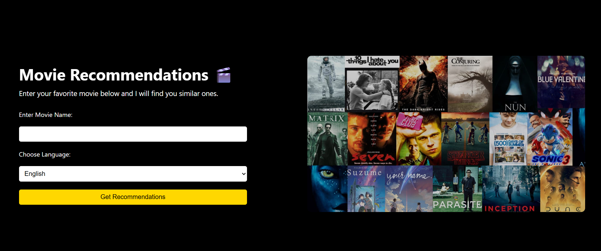
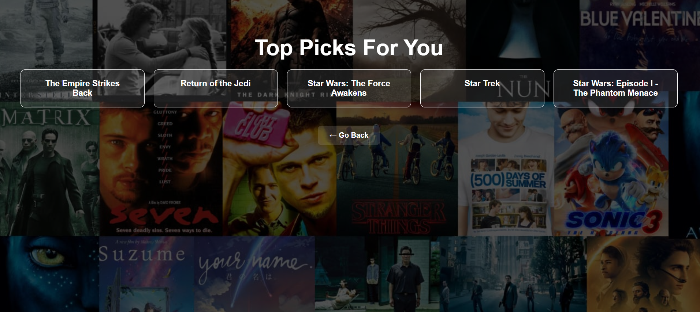

# 🎬 Movie Recommendation Website

This is a simple web application that recommends movies based on your favorite one. It uses the TMDB (The Movie Database) API to fetch movie data and display similar titles.

## ✨ Features
- Search for any movie
- Get recommended similar movies
- Sleek and dark-themed UI

## 💻 Built With
- Python
- Flask
- HTML & CSS
- TMDB API

## 🚀 How to Run Locally
1. Clone this repository
2. Install dependencies using `pip install -r requirements.txt`
3. Run the Flask app: `python app.py`
4. Open `http://localhost:5000` in your browser

## 📦 Requirements
- Flask
- requests
- tmdbv3api (or direct API usage)

## 📷 Preview
  

